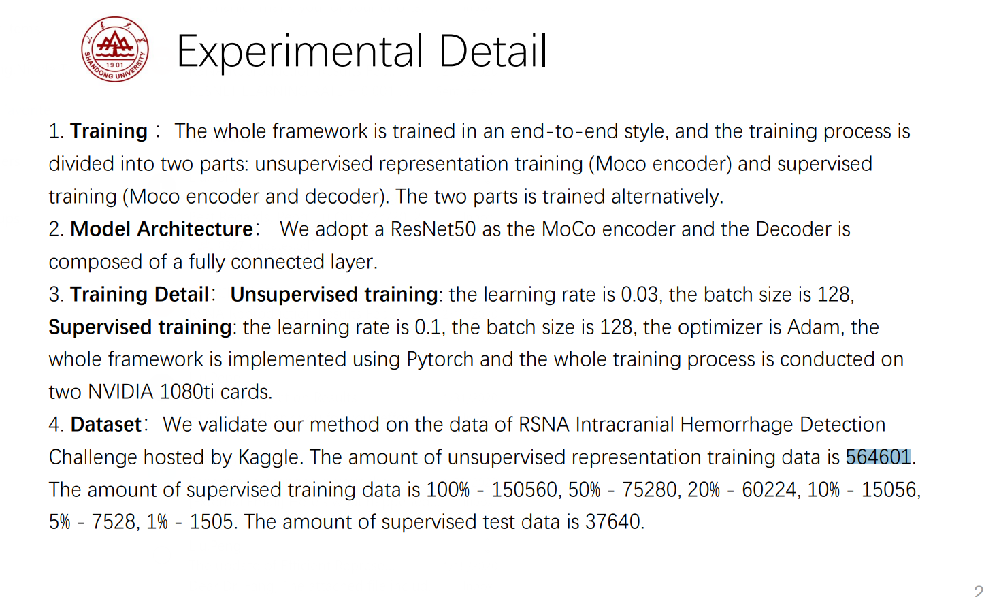

运行步骤：
一、准备数据
1、在kaggle上下载好训练数据 https://www.kaggle.com/c/rsna-intracranial-hemorrhage-detection/data
2、根据此文件夹中的data格式创建数据文件夹。把下载好的训练数据解压到rsna-intracranial-hemorrhage-detection里面的stage_2_train中，RSNApng存放预处理过的图像，RSNATR存放MoCo训练数据，RSNAFTR存放有监督fintune的训练数据，RSNAFVAL存放有监督finetune的测试数据
3、对dcm数据预处理。运行prepare文件夹中datawriter.py。设置dcm_path（rsna-intracranial-hemorrhage-detection/stage_2_train）和png_path（RSNApng），将stage_2_train里面的dcm文件通过预处理生成png文件并存放在png_path中。
4、将RSNApng所有训练图像分为MoCo无监督训练数据和有监督finetune数据。运行prepare文件夹中的movefile.py。设置split里面的系数，将RSNApng中的图像分为RSNATR和RSNAVAL，RSNATR的数据为RSNApng的0.75。运行后，同样把RSNAVAL中数据分为finetune训练集RSNAFTR和finetune测试集RSNAFVAL，RSNAFTR的数据是RSNAVAL的0.8。
5、对RSNAFTR和RSNAFVAL生成的txt文件。运行prepare文件夹中txt_writer.py，设置路径和txt文件地址，根据不同的设置，可以得到不同比例训练数据的txt文件，运行后txt文件存放于experiments_configure里面，train1F.txt、train5F.txt、train10F.txt、train20F.txt、train50F.txt、trainF.txt’分别指采用1%、5%、10%、20%、50%和100%的训练数据有监督finetune。valF.txt为有监督finetune测试数据。
二、根据不同比例训练数据进行有监督finetune
1、multilabel_eval_MoCo是MoCo模型的有监督finetune程序，multilabel_eval_resnet50是ResNet50的有监督fientune程序。
2、设置参数。train_txt参数为不同比例训练数据的txt文件，val_txt为测试数据txt文件。model_path是已经训练好的MoCo模型。data_folder为此文件夹的data文件夹。
3、运行multilabel_eval_MoCo.py查看MoCo的实验结果。
4、运行multilabel_eval_resnet50.py查看ResNet50的实验结果。
